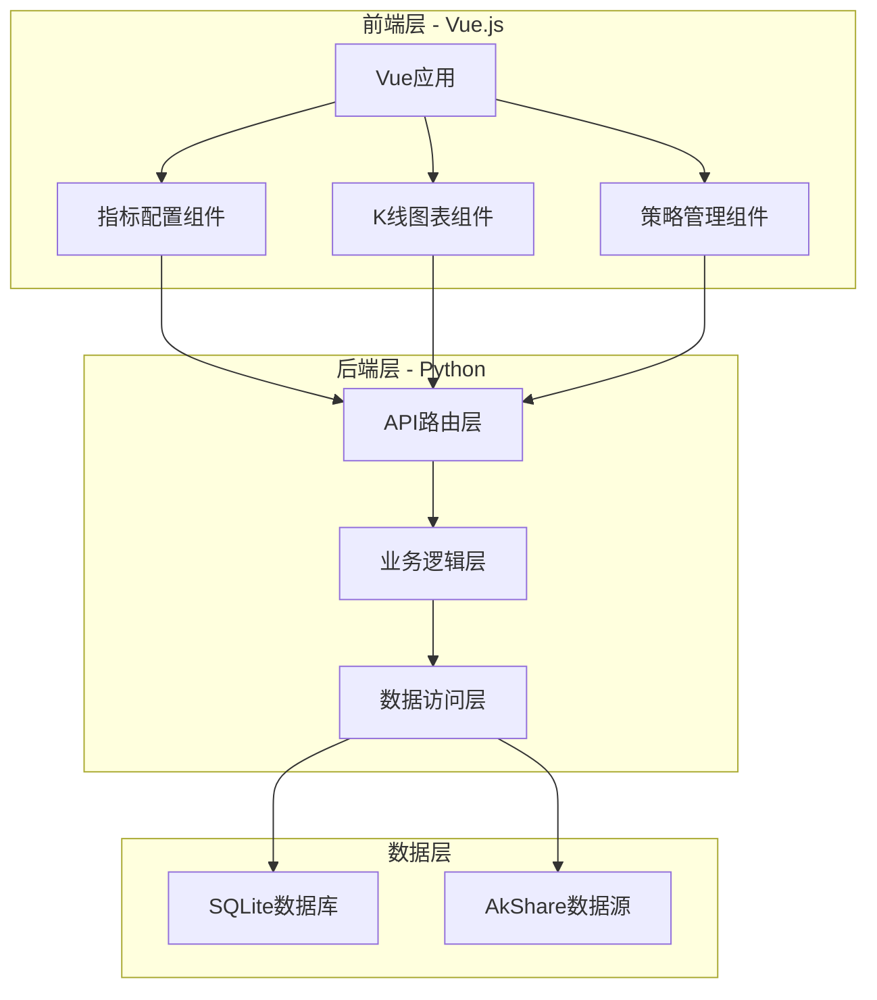

# 设计文档

## 概述

中国A股量化交易系统采用前后端分离架构，前端使用Vue.js构建单页应用，后端使用Python Flask/FastAPI提供RESTful API服务。系统通过AkShare库获取A股数据，使用SQLite存储历史数据，使用pandas和numpy进行技术指标计算。

## 架构

### 系统架构图



### 技术栈

**前端**:
- Vue 3 + Composition API
- Vue Router（路由管理）
- Pinia（状态管理）
- Axios（HTTP客户端）
- ECharts（图表可视化）
- Element Plus（UI组件库）

**后端**:
- Python 3.9+
- FastAPI（Web框架）
- SQLAlchemy（ORM）
- Pandas（数据处理）
- NumPy（数值计算）
- AkShare（数据获取）
- Pydantic（数据验证）

**数据库**:
- SQLite（开发环境）
- PostgreSQL（生产环境可选）

## 组件和接口

### 前端组件

#### 1. StockSelector（股票选择器）
```typescript
interface StockSelectorProps {
  modelValue: string;  // 当前选中的股票代码
}

interface StockSelectorEmits {
  'update:modelValue': (code: string) => void;
  'change': (stock: StockInfo) => void;
}

interface StockInfo {
  code: string;      // 股票代码
  name: string;      // 股票名称
  exchange: string;  // 交易所 (SH/SZ)
}
```

#### 2. IndicatorConfig（指标配置器）
```typescript
interface IndicatorConfigProps {
  indicatorType: string;  // 指标类型 (MA/MACD/RSI/BOLL)
}

interface IndicatorParams {
  type: string;           // 指标类型
  params: Record<string, number>;  // 参数配置
}

interface IndicatorConfigEmits {
  'save': (config: IndicatorParams) => void;
  'cancel': () => void;
}
```

#### 3. KLineChart（K线图表）
```typescript
interface KLineChartProps {
  stockCode: string;
  period: 'daily' | 'weekly' | 'monthly';
  indicators: IndicatorParams[];
}

interface ChartData {
  dates: string[];
  klines: KLineData[];
  indicators: Record<string, number[]>;
}

interface KLineData {
  open: number;
  close: number;
  high: number;
  low: number;
  volume: number;
}
```

#### 4. StrategyManager（策略管理器）
```typescript
interface Strategy {
  id: string;
  name: string;
  description: string;
  indicators: IndicatorParams[];
  conditions: TradingCondition[];
  createdAt: string;
}

interface TradingCondition {
  indicator: string;
  operator: '>' | '<' | '=' | 'cross_up' | 'cross_down';
  value: number | string;
}
```

### 后端API接口

#### 1. 股票数据接口

```python
# GET /api/stocks
# 获取所有A股列表
Response: {
  "stocks": [
    {
      "code": "600000.SH",
      "name": "浦发银行",
      "exchange": "SH",
      "industry": "银行"
    }
  ]
}

# GET /api/stocks/{code}/kline?start_date=2023-01-01&end_date=2024-01-01&period=daily
# 获取K线数据
Response: {
  "code": "600000.SH",
  "name": "浦发银行",
  "data": [
    {
      "date": "2023-01-03",
      "open": 8.50,
      "close": 8.65,
      "high": 8.70,
      "low": 8.45,
      "volume": 12345678
    }
  ]
}

# GET /api/stocks/{code}/info
# 获取股票基本信息
Response: {
  "code": "600000.SH",
  "name": "浦发银行",
  "exchange": "SH",
  "industry": "银行",
  "list_date": "1999-11-10",
  "market_cap": 250000000000
}
```

#### 2. 技术指标接口

```python
# POST /api/indicators/calculate
# 计算技术指标
Request: {
  "stock_code": "600000.SH",
  "indicator_type": "MA",
  "params": {
    "periods": [5, 10, 20, 60]
  },
  "start_date": "2023-01-01",
  "end_date": "2024-01-01"
}

Response: {
  "indicator_type": "MA",
  "data": {
    "dates": ["2023-01-03", "2023-01-04", ...],
    "MA5": [8.52, 8.55, ...],
    "MA10": [8.48, 8.50, ...],
    "MA20": [8.45, 8.46, ...],
    "MA60": [8.40, 8.41, ...]
  }
}

# GET /api/indicators/types
# 获取支持的指标类型
Response: {
  "indicators": [
    {
      "type": "MA",
      "name": "移动平均线",
      "params": [
        {"name": "periods", "type": "array", "default": [5, 10, 20]}
      ]
    },
    {
      "type": "MACD",
      "name": "指数平滑异同移动平均线",
      "params": [
        {"name": "fast_period", "type": "int", "default": 12},
        {"name": "slow_period", "type": "int", "default": 26},
        {"name": "signal_period", "type": "int", "default": 9}
      ]
    }
  ]
}
```

#### 3. 策略管理接口

```python
# GET /api/strategies
# 获取所有策略
Response: {
  "strategies": [
    {
      "id": "uuid-1234",
      "name": "双均线策略",
      "description": "MA5上穿MA20买入",
      "created_at": "2024-01-01T10:00:00Z"
    }
  ]
}

# POST /api/strategies
# 创建新策略
Request: {
  "name": "双均线策略",
  "description": "MA5上穿MA20买入",
  "indicators": [
    {"type": "MA", "params": {"periods": [5, 20]}}
  ],
  "conditions": [
    {
      "indicator": "MA5",
      "operator": "cross_up",
      "value": "MA20"
    }
  ]
}

Response: {
  "id": "uuid-1234",
  "name": "双均线策略",
  "created_at": "2024-01-01T10:00:00Z"
}

# DELETE /api/strategies/{id}
# 删除策略
Response: {
  "success": true,
  "message": "策略已删除"
}
```

### 后端核心模块

#### 1. DataProvider（数据提供者）

```python
class DataProvider:
    """负责从AkShare获取股票数据"""
    
    def get_stock_list(self) -> List[StockInfo]:
        """获取所有A股列表"""
        pass
    
    def get_kline_data(
        self, 
        stock_code: str, 
        start_date: str, 
        end_date: str,
        period: str = 'daily'
    ) -> pd.DataFrame:
        """获取K线数据"""
        pass
    
    def get_stock_info(self, stock_code: str) -> StockInfo:
        """获取股票基本信息"""
        pass
```

#### 2. IndicatorCalculator（指标计算器）

```python
class IndicatorCalculator:
    """负责计算技术指标"""
    
    def calculate_ma(
        self, 
        data: pd.DataFrame, 
        periods: List[int]
    ) -> Dict[str, pd.Series]:
        """计算移动平均线"""
        pass
    
    def calculate_macd(
        self,
        data: pd.DataFrame,
        fast_period: int = 12,
        slow_period: int = 26,
        signal_period: int = 9
    ) -> Dict[str, pd.Series]:
        """计算MACD指标"""
        pass
    
    def calculate_rsi(
        self,
        data: pd.DataFrame,
        period: int = 14
    ) -> pd.Series:
        """计算RSI指标"""
        pass
    
    def calculate_boll(
        self,
        data: pd.DataFrame,
        period: int = 20,
        std_dev: float = 2.0
    ) -> Dict[str, pd.Series]:
        """计算布林带"""
        pass
```

#### 3. DataRepository（数据仓库）

```python
class DataRepository:
    """负责数据库操作"""
    
    def save_kline_data(
        self, 
        stock_code: str, 
        data: pd.DataFrame
    ) -> None:
        """保存K线数据"""
        pass
    
    def get_kline_data(
        self,
        stock_code: str,
        start_date: str,
        end_date: str
    ) -> pd.DataFrame:
        """从数据库获取K线数据"""
        pass
    
    def save_strategy(self, strategy: Strategy) -> str:
        """保存策略配置"""
        pass
    
    def get_strategies(self) -> List[Strategy]:
        """获取所有策略"""
        pass
    
    def delete_strategy(self, strategy_id: str) -> bool:
        """删除策略"""
        pass
```

## 数据模型

### 数据库表结构

#### 1. stocks（股票信息表）

```sql
CREATE TABLE stocks (
    code VARCHAR(10) PRIMARY KEY,      -- 股票代码
    name VARCHAR(50) NOT NULL,         -- 股票名称
    exchange VARCHAR(2) NOT NULL,      -- 交易所 (SH/SZ)
    industry VARCHAR(50),              -- 所属行业
    list_date DATE,                    -- 上市日期
    updated_at TIMESTAMP DEFAULT CURRENT_TIMESTAMP
);

CREATE INDEX idx_stocks_exchange ON stocks(exchange);
CREATE INDEX idx_stocks_industry ON stocks(industry);
```

#### 2. kline_data（K线数据表）

```sql
CREATE TABLE kline_data (
    id INTEGER PRIMARY KEY AUTOINCREMENT,
    stock_code VARCHAR(10) NOT NULL,   -- 股票代码
    trade_date DATE NOT NULL,          -- 交易日期
    open DECIMAL(10, 2) NOT NULL,      -- 开盘价
    close DECIMAL(10, 2) NOT NULL,     -- 收盘价
    high DECIMAL(10, 2) NOT NULL,      -- 最高价
    low DECIMAL(10, 2) NOT NULL,       -- 最低价
    volume BIGINT NOT NULL,            -- 成交量
    amount DECIMAL(20, 2),             -- 成交额
    period VARCHAR(10) DEFAULT 'daily', -- 周期类型
    created_at TIMESTAMP DEFAULT CURRENT_TIMESTAMP,
    UNIQUE(stock_code, trade_date, period)
);

CREATE INDEX idx_kline_stock_date ON kline_data(stock_code, trade_date);
CREATE INDEX idx_kline_date ON kline_data(trade_date);
```

#### 3. strategies（策略配置表）

```sql
CREATE TABLE strategies (
    id VARCHAR(36) PRIMARY KEY,        -- UUID
    name VARCHAR(100) NOT NULL,        -- 策略名称
    description TEXT,                  -- 策略描述
    config JSON NOT NULL,              -- 策略配置（JSON格式）
    created_at TIMESTAMP DEFAULT CURRENT_TIMESTAMP,
    updated_at TIMESTAMP DEFAULT CURRENT_TIMESTAMP
);

CREATE INDEX idx_strategies_created ON strategies(created_at);
```

### Python数据模型

```python
from pydantic import BaseModel, Field
from typing import List, Dict, Optional
from datetime import date, datetime

class StockInfo(BaseModel):
    code: str = Field(..., pattern=r'^\d{6}\.(SH|SZ)$')
    name: str
    exchange: str = Field(..., pattern=r'^(SH|SZ)$')
    industry: Optional[str] = None
    list_date: Optional[date] = None

class KLineData(BaseModel):
    stock_code: str
    trade_date: date
    open: float = Field(..., gt=0)
    close: float = Field(..., gt=0)
    high: float = Field(..., gt=0)
    low: float = Field(..., gt=0)
    volume: int = Field(..., ge=0)
    amount: Optional[float] = None
    period: str = Field(default='daily', pattern=r'^(daily|weekly|monthly)$')

class IndicatorParams(BaseModel):
    type: str
    params: Dict[str, any]

class TradingCondition(BaseModel):
    indicator: str
    operator: str = Field(..., pattern=r'^(>|<|=|cross_up|cross_down)$')
    value: any

class Strategy(BaseModel):
    id: Optional[str] = None
    name: str = Field(..., min_length=1, max_length=100)
    description: Optional[str] = None
    indicators: List[IndicatorParams]
    conditions: List[TradingCondition]
    created_at: Optional[datetime] = None
```

## 正确性属性

*属性是一个特征或行为，应该在系统的所有有效执行中保持为真——本质上是关于系统应该做什么的正式陈述。属性作为人类可读规范和机器可验证正确性保证之间的桥梁。*

### 属性 1: K线数据完整性约束

*对于任何*K线数据记录，必须满足以下不变式：最高价 >= 最大值(开盘价, 收盘价) 且 最低价 <= 最小值(开盘价, 收盘价) 且 最高价 >= 最低价

**验证: 需求 2.1, 9.2**

### 属性 2: 数据存储往返一致性

*对于任何*有效的K线数据记录，存储到数据库后再读取应该得到包含所有字段（日期、开盘价、收盘价、最高价、最低价、成交量）的等价记录

**验证: 需求 2.1**

### 属性 3: 数据存储幂等性

*对于任何*K线数据记录，对同一股票代码和日期多次存储应该只保留一条记录，且最终值为最后一次更新的值

**验证: 需求 2.2**

### 属性 4: 指标计算确定性

*对于任何*给定的K线数据和指标参数，多次计算应该产生完全相同的结果（确定性）

**验证: 需求 3.5**

### 属性 5: 移动平均线计算正确性

*对于任何*K线数据序列和周期N，计算出的N日移动平均线的每个点应该等于前N个收盘价的算术平均值

**验证: 需求 3.1**

### 属性 6: RSI范围约束

*对于任何*K线数据序列和周期参数，计算出的RSI值应该始终在0到100之间（包含边界）

**验证: 需求 3.3**

### 属性 7: MACD零轴交叉一致性

*对于任何*K线数据序列，当MACD的DIF线和DEA线交叉时，MACD柱状图（DIF-DEA）应该穿过零轴

**验证: 需求 3.2**

### 属性 8: 布林带包络性

*对于任何*K线数据序列，使用标准参数（20日，2倍标准差）计算的布林带应该包含至少90%的收盘价在上轨和下轨之间

**验证: 需求 3.4**

### 属性 9: 指标计算数据充足性验证

*对于任何*技术指标计算请求，当数据点数量少于所需周期时，系统应该返回错误而不是计算出错误的结果

**验证: 需求 3.6**

### 属性 10: 输入验证完整性

*对于任何*API输入参数，系统应该验证：股票代码符合格式（6位数字+.SH或.SZ）、日期格式有效、数值参数在合理范围内，不符合的应该被拒绝并返回明确错误

**验证: 需求 9.1, 9.3, 9.4**

### 属性 11: 异常数据拒绝

*对于任何*包含异常值（负数价格、负数成交量、最高价<最低价）的K线数据，系统应该拒绝存储并记录警告

**验证: 需求 9.2**

### 属性 12: 策略配置往返一致性

*对于任何*有效的策略配置对象，保存到数据库后再读取应该得到等价的配置（包括名称、描述、指标列表、条件列表）

**验证: 需求 7.3**

### 属性 13: 错误响应格式一致性

*对于任何*导致错误的API请求，系统应该返回包含错误代码、错误消息、详细信息和时间戳的标准JSON格式响应

**验证: 需求 4.6, 8.3**

### 属性 14: 前端参数验证实时性

*对于任何*用户在前端输入的指标参数，当输入无效时（如负数周期、非数字字符），系统应该立即显示验证错误而不是等待提交

**验证: 需求 5.3**

### 属性 15: 并发请求隔离性

*对于任何*两个并发的数据查询请求（不同股票或不同日期范围），它们应该互不干扰，各自返回正确的结果

**验证: 需求 10.2**

### 属性 16: 缓存一致性

*对于任何*被缓存的数据，当底层数据库数据更新时，后续读取应该返回更新后的数据而不是过期的缓存值

**验证: 需求 10.3**

## 错误处理

### 错误类型定义

```python
class QuantTradingError(Exception):
    """基础异常类"""
    pass

class DataSourceError(QuantTradingError):
    """数据源错误（AkShare调用失败）"""
    pass

class DataValidationError(QuantTradingError):
    """数据验证错误"""
    pass

class IndicatorCalculationError(QuantTradingError):
    """指标计算错误"""
    pass

class DatabaseError(QuantTradingError):
    """数据库操作错误"""
    pass
```

### 错误处理策略

1. **数据源错误**
   - 捕获AkShare调用异常
   - 记录详细错误日志
   - 尝试从缓存或数据库获取历史数据
   - 返回HTTP 503（服务不可用）

2. **数据验证错误**
   - 验证所有输入参数
   - 返回HTTP 400（错误请求）和详细错误信息
   - 不存储无效数据

3. **指标计算错误**
   - 检查数据充足性
   - 返回HTTP 400和具体错误原因
   - 记录警告日志

4. **数据库错误**
   - 实施自动重试机制（最多3次）
   - 使用事务确保数据一致性
   - 返回HTTP 500（服务器错误）

### API错误响应格式

```json
{
  "error": {
    "code": "DATA_SOURCE_ERROR",
    "message": "无法从数据源获取数据",
    "details": "AkShare API调用超时",
    "timestamp": "2024-01-01T10:00:00Z"
  }
}
```

## 测试策略

### 双重测试方法

系统将采用单元测试和基于属性的测试相结合的方法：

- **单元测试**: 验证特定示例、边界情况和错误条件
- **属性测试**: 通过随机化输入验证所有输入的通用属性
- 两者是互补的，对于全面覆盖都是必要的

### 单元测试

单元测试专注于：
- 特定示例（如计算MA5 = [10, 11, 12, 13, 14]的平均值）
- 组件之间的集成点
- 边界情况和错误条件（如空数据、单个数据点）

避免编写过多的单元测试 - 基于属性的测试处理大量输入的覆盖。

### 基于属性的测试

使用**Hypothesis**库进行Python属性测试：

```python
from hypothesis import given, strategies as st
import hypothesis.extra.pandas as pdst

@given(
    kline_data=pdst.data_frames(
        columns=[
            pdst.column('open', dtype=float),
            pdst.column('close', dtype=float),
            pdst.column('high', dtype=float),
            pdst.column('low', dtype=float),
        ]
    )
)
def test_kline_data_integrity(kline_data):
    """
    Feature: a-share-quant-trading, Property 1: K线数据完整性
    对于任何K线数据，最高价应该大于等于开盘价、收盘价、最低价
    """
    assert (kline_data['high'] >= kline_data['open']).all()
    assert (kline_data['high'] >= kline_data['close']).all()
    assert (kline_data['high'] >= kline_data['low']).all()
    assert (kline_data['low'] <= kline_data['open']).all()
    assert (kline_data['low'] <= kline_data['close']).all()
```

### 属性测试配置

- 每个属性测试最少运行**100次迭代**
- 每个测试必须引用其设计文档属性
- 标签格式: **Feature: a-share-quant-trading, Property {number}: {property_text}**
- 每个正确性属性必须由单个基于属性的测试实现

### 测试覆盖目标

- 单元测试覆盖率: > 80%
- 属性测试: 覆盖所有14个正确性属性
- 集成测试: 覆盖主要API端点
- 前端测试: 使用Vitest进行组件测试

### 前端测试

```typescript
// 使用Vitest和Vue Test Utils
import { mount } from '@vue/test-utils'
import { describe, it, expect } from 'vitest'
import IndicatorConfig from '@/components/IndicatorConfig.vue'

describe('IndicatorConfig', () => {
  it('应该验证MA周期参数为正整数', () => {
    const wrapper = mount(IndicatorConfig, {
      props: { indicatorType: 'MA' }
    })
    
    // 测试负数输入
    wrapper.find('input[name="period"]').setValue(-5)
    expect(wrapper.find('.error-message').text()).toContain('周期必须为正整数')
  })
})
```

## 性能优化

### 数据库优化

1. **索引策略**
   - 在stock_code和trade_date上建立复合索引
   - 在常用查询字段上建立单列索引

2. **查询优化**
   - 使用参数化查询防止SQL注入
   - 批量插入数据而非逐条插入
   - 使用连接池管理数据库连接

### 计算优化

1. **向量化计算**
   - 使用pandas和numpy的向量化操作
   - 避免Python循环计算指标

2. **缓存策略**
   - 使用Redis缓存频繁查询的数据
   - 缓存已计算的指标结果
   - 设置合理的缓存过期时间

### API优化

1. **异步处理**
   - 使用FastAPI的异步特性
   - 数据获取和计算使用异步IO

2. **请求限流**
   - 实施令牌桶算法限制请求频率
   - 防止恶意请求和数据源封禁

## 安全考虑

1. **输入验证**
   - 使用Pydantic验证所有API输入
   - 验证股票代码格式
   - 验证日期范围合理性

2. **SQL注入防护**
   - 使用SQLAlchemy ORM
   - 使用参数化查询

3. **CORS配置**
   - 配置允许的前端域名
   - 限制允许的HTTP方法

4. **数据源访问**
   - 遵守AkShare使用条款
   - 实施请求频率限制
   - 处理API密钥（如使用Tushare）

## 部署架构

### 开发环境

```
前端: npm run dev (Vite开发服务器, 端口5173)
后端: uvicorn main:app --reload (FastAPI, 端口8000)
数据库: SQLite (本地文件)
```

### 生产环境

```
前端: Nginx静态文件服务
后端: Gunicorn + Uvicorn workers
数据库: PostgreSQL
缓存: Redis
反向代理: Nginx
```

### Docker部署

```yaml
version: '3.8'
services:
  frontend:
    build: ./frontend
    ports:
      - "80:80"
    depends_on:
      - backend
  
  backend:
    build: ./backend
    ports:
      - "8000:8000"
    environment:
      - DATABASE_URL=postgresql://user:pass@db:5432/quant
    depends_on:
      - db
      - redis
  
  db:
    image: postgres:15
    volumes:
      - postgres_data:/var/lib/postgresql/data
  
  redis:
    image: redis:7
    volumes:
      - redis_data:/data

volumes:
  postgres_data:
  redis_data:
```
